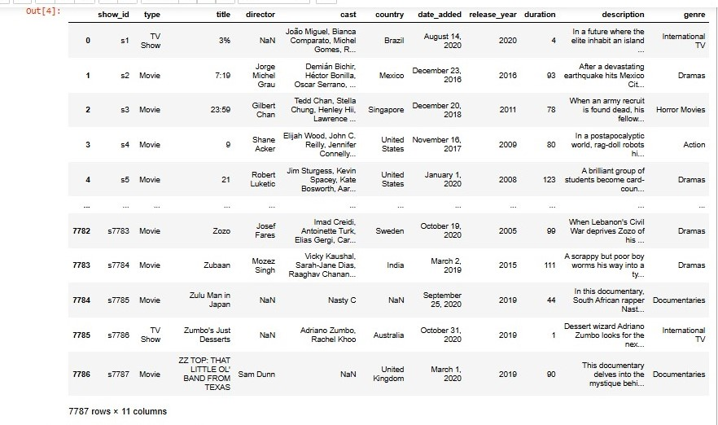
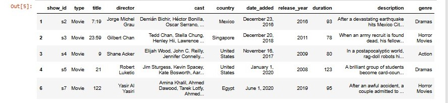
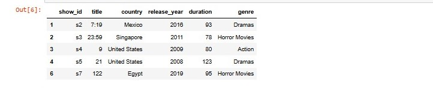
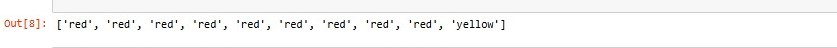
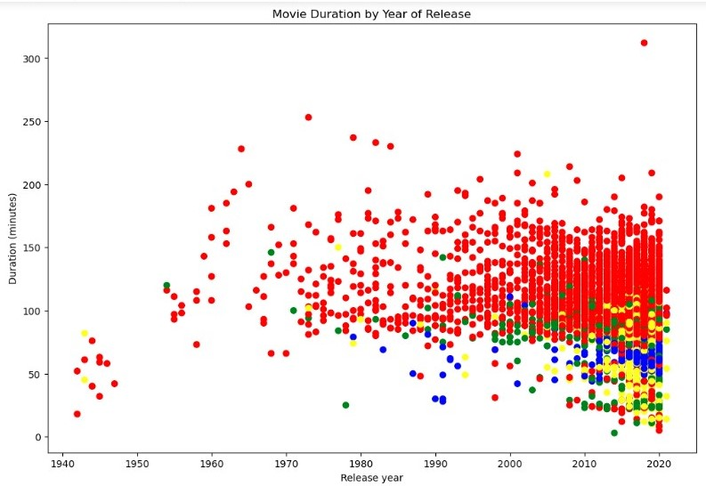

# Investigating Netflix Movies in Python


```python
# Import pandas and matplotlib
import pandas as pd
import matplotlib.pyplot as plt
```

## Data Acquisition

```python
# Import csv file and create df
netflix_df = pd.read_csv('netflix_data.csv')
netflix_df
```


## Data Preparation

```python
# Filter data to remove TV shows
netflix_subset = netflix_df[netflix_df['type'] == 'Movie']
netflix_subset.head()
```


```python
# Drop unwanted columns. Delete columns with df.drop()
netflix_movies = netflix_subset.drop(['type','director','cast','date_added','description'], axis = 1)
netflix_movies.head()
```


```python
short_movies = netflix_movies[netflix_movies['duration'] < 60]
short_movies.head()
```


```python
# Create an empty list
colors = []

# Iterate over rows of netflix_movies
for label, row in netflix_movies.iterrows() :
    if row['genre'] == 'Children' :
        colors.append('green')
    elif row['genre'] == 'Documentaries' :
        colors.append('yellow')
    elif row['genre'] == 'Stand-Up':
        colors.append('blue')
    else:
        colors.append('red')
        
# Inspect the first 10 values in your list        
colors[:10]
```


## Visualization

```python
# Set figsize and Visualize netflix_movies duration by release year
plt.figure(figsize=(12,8))

plt.scatter(netflix_movies['release_year'], netflix_movies['duration'], c=colors)

plt.title('Movie Duration by Year of Release')
plt.xlabel('Release year')
plt.ylabel('Duration (minutes)')

# Show plot
plt.show()
```


## Interpretation and Insight

The scatter plot shows Movie duration by Year by of Release. Majority of the markers of the scatter plot are clustered above 60 minutes. This indicates that Netflix movies are not getting shorter as assumed.
